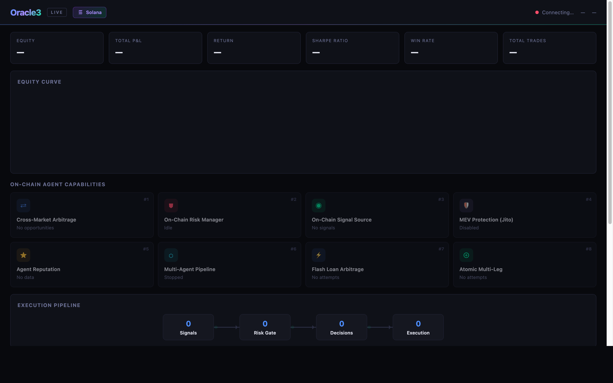

<p align="center">
  
</p>

<h1 align="center">Oracle3</h1>
<p align="center">
  <strong>Autonomous On-Chain Trading Agent for Prediction Markets</strong>
</p>

<p align="center">
  <a href="https://github.com/YichengYang-Ethan/oracle3/actions"></a>
  <a href="https://github.com/YichengYang-Ethan/oracle3/actions"></a>
  <a href="https://github.com/YichengYang-Ethan/oracle3/actions"></a>
  
  
  
</p>

<p align="center">
  <em>A fully autonomous agent that reads on-chain data, generates trade signals, signs Solana transactions, and manages risk end-to-end — no human in the loop.</em>
</p>

---

<p align="center">
  
  <br>
  <sub>Live trading dashboard — 8 on-chain agent capabilities, real-time equity curve, execution pipeline</sub>
</p>

## Why On-Chain Agents?

DeFi is shifting from human-operated dashboards to **autonomous agents** that perceive, decide, and execute entirely on-chain. Prediction markets are the ideal proving ground: discrete outcomes, transparent order books, and real-money accountability force an agent to be right — not just convincing.

Oracle3 is built on this thesis. It treats the Solana blockchain as the agent's native runtime: reading on-chain state for signals, simulating transactions before committing capital, writing an immutable audit trail via the Memo program, and composing instructions atomically so complex multi-leg trades either fully succeed or fully revert. Every capability — from MEV protection to flash-loan arbitrage — is designed around on-chain primitives rather than off-chain workarounds.

### Why Solana?

| Property | Why it matters for agents |
|----------|--------------------------|
| **Sub-second finality** | Agents can observe → decide → execute within a single block window |
| **Transaction simulation** | `simulateTransaction` lets agents dry-run before committing capital |
| **Atomic composability** | Multiple instructions in one transaction — all-or-nothing execution |
| **On-chain transparency** | Every trade is publicly verifiable; builds agent reputation over time |
| **Low fees** | Enables high-frequency micro-strategies that would be cost-prohibitive on L1 Ethereum |

## Architecture

```
                              ┌──────────────────────┐
                              │    Oracle3 CLI        │
                              │  paper│live│blinks    │
                              └──────────┬───────────┘
                                         │
                    ┌────────────────────┬┴──────────────────────┐
                    │                    │                        │
           ┌────────▼────────┐  ┌────────▼────────┐  ┌──────────▼─────────┐
           │  Agent Strategy │  │ Quant Strategy   │  │  Contrib Strategies│
           │  (LLM + Tools)  │  │ (Momentum/MR/MM) │  │  (Debate/News/Arb) │
           └────────┬────────┘  └────────┬────────┘  └──────────┬─────────┘
                    └────────────────────┼──────────────────────┘
                                         │
                              ┌──────────▼───────────┐
                              │    Trading Engine     │
                              │  Event Loop + Risk    │
                              │  + Position Manager   │
                              └──────────┬───────────┘
                                         │
                    ┌────────────────────┬┴──────────────────────┐
                    │                    │                        │
           ┌────────▼────────┐  ┌────────▼────────┐  ┌──────────▼─────────┐
           │  Solana/DFlow   │  │   Polymarket     │  │      Kalshi        │
           │  SPL Tokens     │  │   CLOB API       │  │    REST API        │
           └─────────────────┘  └─────────────────┘  └────────────────────┘
                    │
           ┌────────▼────────┐
           │  Solana Blinks  │  ← Shareable trade URLs
           │  On-Chain Logs  │  ← Memo program audit trail
           └─────────────────┘
```

## Key Features

### 8 On-Chain Agent Capabilities

Oracle3 implements 8 core capabilities that a production-grade on-chain agent needs — from perception to execution to self-assessment. All are observable in real time through the live dashboard:

| # | Feature | Description |
|---|---------|-------------|
| 1 | **Cross-Market Arbitrage** | Detects same-event price discrepancies across DFlow, Polymarket, and Kalshi; trades when spread exceeds configurable threshold |
| 2 | **On-Chain Risk Manager** | Dual-layer risk: local limits (position size, exposure, drawdown) + Solana `simulateTransaction` pre-flight check |
| 3 | **On-Chain Signal Source** | Polls Solana RPC for whale wallet movements, large SPL transfers, and DFlow TVL changes as trading signals |
| 4 | **MEV Protection (Jito)** | Wraps transactions in Jito Bundles with tip for frontrunning protection; auto-fallback to standard RPC |
| 5 | **Agent Reputation** | Computes 0–100 on-chain reputation score from win rate, Sharpe, consistency; writes periodic summaries via Memo program |
| 6 | **Multi-Agent Pipeline** | SignalAgent → RiskAgent → ExecutionAgent coordination pipeline for complex multi-step trade decisions |
| 7 | **Flash Loan Arbitrage** | Atomic borrow → buy → sell → repay within a single Solana transaction via MarginFi/Solend |
| 8 | **Atomic Multi-Leg Trader** | Packs DFlow + Jupiter + Drift instructions into one all-or-nothing Solana transaction |

### AI-Powered Trading
- **LLM Agent Strategies** via OpenAI Agents SDK with 8 built-in tools (place trades, read order books, check positions, fetch news)
- **Adaptive Quant Strategies** — OB imbalance + EMA momentum with self-tuning weights
- **Hybrid approach** — LLM for news analysis, heuristics for order book/price events
- **Multi-provider support** — OpenAI, DeepSeek, or any LiteLLM-compatible model

### Solana Integration
- **Native transaction signing** — builds, signs, and submits Solana transactions
- **On-chain trade logging** — every trade logged to Solana via Memo program
- **Jito MEV protection** — optional bundle submission with configurable tips
- **Solana Blinks** — share trades as clickable URLs anyone can execute

### Multi-Exchange
- **Solana/DFlow** — SPL token prediction markets on mainnet-beta (REST + WebSocket + CoinGecko)
- **Polymarket** — CLOB API with USDC collateral
- **Kalshi** — regulated US prediction markets
- **Cross-platform arbitrage** — detect price differences across exchanges

### Risk Management
- **On-chain risk manager** with dual-layer validation (local + RPC simulation)
- Per-trade size limits, position limits, exposure caps
- Max drawdown monitoring with auto-pause
- Daily loss limits and kill switch
- Portfolio health gate with auto-degradation

### Live Trading Dashboard
- **`/live` dashboard** — real-time single-page app at `http://localhost:3000/live`
- **8 feature cards** — click any card to see detailed modal with live data
- **Equity chart** — Canvas-based line chart with gradient fill
- **Execution pipeline** — animated Signal → Risk → Decision → Execution flow
- **Controls** — Pause / Resume / E-Stop buttons via REST API
- **Responsive** — 4 → 2 → 1 column layout at different viewports
- **Classic dashboard** at `/` — original terminal-style monitoring
- **Terminal TUI** with Rich/Textual for headless environments

## Quick Start

### Install

```bash
git clone https://github.com/YichengYang-Ethan/oracle3.git
cd oracle3
poetry install
```

### Browse Markets

```bash
# List Solana/DFlow prediction markets
oracle3 market list --exchange solana --limit 10

# Search Polymarket
oracle3 market search --query "bitcoin" --exchange polymarket
```

### Paper Trading (with Live Dashboard)

```bash
# Launch with adaptive quant strategy — all 8 on-chain features auto-load
oracle3 dashboard --exchange solana \
  --strategy-ref oracle3.strategy.contrib.adaptive_onchain_strategy:AdaptiveOnChainStrategy \
  --initial-capital 10000
```

Open **`http://localhost:3000/live`** for the full live dashboard, or `/` for the classic view.

### Backtest with DFlow Episodes

```bash
oracle3 dashboard --exchange solana \
  --strategy-ref oracle3.strategy.contrib.cross_market_arbitrage_strategy:CrossMarketArbitrageStrategy \
  --episode-dir data/episodes/dflow_15min
```

### Live Trading (Solana)

```bash
oracle3 live run \
  --exchange solana \
  --strategy-ref oracle3.strategy.contrib.solana_agent_strategy:SolanaAgentStrategy \
  --solana-keypair-path ./keypair.json \
  --use-jito \
  --onchain-signals \
  --monitor
```

### Agent Reputation

```bash
oracle3 reputation --wallet 7RQ3YL4cLNbQbwAUHBP6GzdRbG6NRng8qBcHbiDrf8Ae
```

### Solana Blinks

```bash
# Start the Solana Actions server
oracle3 blinks --port 8080

# Generate a shareable Blink URL
curl http://localhost:8080/api/trade/MARKET_TICKER
```

### On-Chain Trade Log

```bash
# View trades logged to Solana blockchain
oracle3 trade-log --limit 20 --json
```

### Run the Demo

```bash
./demo.sh
```

## How It Works

```
1. Data Sources fetch live market data + news + on-chain signals (#3)
          ↓
2. AI Agent / Quant Strategy analyzes events (multi-agent pipeline #6)
          ↓
3. Strategy generates trade signals with confidence scores
          ↓
4. On-Chain Risk Manager (#2) validates against portfolio limits + simulates tx
          ↓
5. Trader signs tx, optionally via Jito Bundle (#4) for MEV protection
          ↓  May use Flash Loan (#7) or Atomic Multi-Leg (#8) execution
6. On-Chain Logger writes trade to Solana Memo + updates Reputation (#5)
          ↓
7. Live Dashboard shows real-time P&L, equity curve, 8 feature cards
```

## Project Structure

```
oracle3/
├── agent/                # Multi-agent coordination (SignalAgent → RiskAgent → ExecutionAgent)
├── cli/                  # CLI commands (Click)
├── core/                 # Trading engine with event loop + snapshot system
├── strategy/             # Strategy framework
│   ├── agent_strategy.py # LLM agent with tool calling
│   ├── quant_strategy.py # Quantitative strategies
│   └── contrib/          # Contributed strategies
│       ├── adaptive_onchain_strategy.py  # OB imbalance + EMA momentum (self-tuning)
│       ├── cross_market_arbitrage_strategy.py  # Cross-exchange arb
│       ├── multi_agent_strategy.py       # Multi-agent pipeline strategy
│       └── solana_agent_strategy.py      # LLM-driven Solana agent
├── trader/               # Exchange-specific traders
│   ├── solana_trader.py  # Solana/DFlow transaction signing + Jito
│   ├── jito_submitter.py # Jito Bundle MEV protection (#4)
│   ├── flash_loan.py     # Flash loan arbitrage (#7)
│   ├── atomic_trader.py  # Atomic multi-leg trades (#8)
│   ├── polymarket_trader.py
│   └── kalshi_trader.py
├── data/                 # Data sources (live + backtest)
│   └── live/
│       ├── dflow_data_source.py         # DFlow REST polling
│       ├── dflow_ws_data_source.py      # DFlow WebSocket streaming
│       ├── coingecko_x402_data_source.py # CoinGecko SOL/crypto prices
│       └── onchain_signal_source.py     # Whale wallet + TVL signals (#3)
├── blinks/               # Solana Blinks/Actions server
├── onchain/              # On-chain trade logging + reputation (#5)
├── dashboard/            # Web dashboard (FastAPI + WebSocket)
│   └── static/
│       ├── index.html    # Classic terminal dashboard (/)
│       ├── live.html     # Live trading dashboard (/live) with 8 feature cards
│       └── demo.html     # Interactive demo
├── risk/                 # Risk management framework
│   ├── risk_manager.py   # Standard risk manager
│   └── onchain_risk_manager.py  # Dual-layer on-chain risk (#2)
├── position/             # Position & P&L tracking
├── analytics/            # Performance analysis (Sharpe, drawdown, etc.)
├── backtest/             # Backtesting engine
└── events/               # Event types (OrderBook, Price, News, OnChainSignal)

tests/                    # Test suite
data/episodes/            # DFlow backtest episodes (parquet)
```

## Tech Stack

| Component | Technology |
|-----------|------------|
| Language | Python 3.10+ (async/await) |
| Solana | solders + solana-py |
| DFlow | REST API (Metadata + Trade) |
| LLM | OpenAI Agents SDK + LiteLLM |
| Web UI | FastAPI + WebSocket |
| Terminal UI | Textual + Rich |
| CLI | Click |
| Testing | pytest + pytest-asyncio |
| Linting | Ruff + MyPy + pre-commit |
| Types | Pydantic + Beartype |

## Environment Variables

```bash
# Solana (required for live trading)
export SOLANA_KEYPAIR_PATH="/path/to/keypair.json"

# LLM Provider
export OPENAI_API_KEY="sk-..."           # OpenAI
# or
export DEEPSEEK_API_KEY="..."            # DeepSeek

# Optional: other exchanges
export POLYMARKET_PRIVATE_KEY="..."
export KALSHI_API_KEY_ID="..."
```

## Development

```bash
poetry install --with dev,test
pytest tests/ -v --cov=oracle3
ruff check . && ruff format .
mypy oracle3/
```

## Motivation

On-chain autonomous agents represent the next evolution of crypto infrastructure. Today's DeFi is overwhelmingly human-operated — users manually swap tokens, rebalance portfolios, and chase yield across protocols. The future is **agentic**: software that holds its own keys, perceives market microstructure directly from blockchain state, makes decisions under uncertainty, and executes atomically — all while building a verifiable, on-chain track record.

Oracle3 is my exploration of what that future looks like in practice. Prediction markets are the sharpest testbed because they provide:

- **Binary accountability** — the agent is either right or wrong, no narrative hedging
- **Rich signal diversity** — order books, news, whale flows, cross-market spreads
- **Composable execution** — flash loans, atomic multi-leg, MEV protection all compose natively on Solana

The goal is not just a profitable bot, but a reference architecture for how LLM reasoning, quantitative signals, and on-chain primitives can be unified into a single autonomous system.

## License

Apache 2.0 — see [LICENSE](LICENSE) for details.

---

<p align="center">
  <sub>This software is for research and educational purposes. Trading on prediction markets involves financial risk.</sub>
</p>
