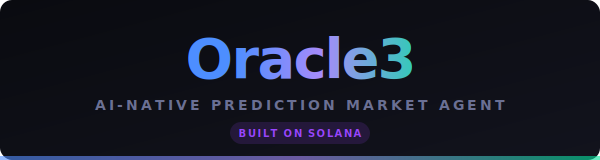

<p align="center">
  
</p>

<h1 align="center">Oracle3</h1>
<p align="center">
  <strong>AI-Native Prediction Market Agent on Solana</strong>
</p>

<p align="center">
  <a href="https://github.com/YichengYang-Ethan/oracle3/actions"></a>
  <a href="https://github.com/YichengYang-Ethan/oracle3/actions"></a>
  <a href="https://github.com/YichengYang-Ethan/oracle3/actions"></a>
  
  
  
  
</p>

<p align="center">
  <em>An autonomous AI trading agent that analyzes prediction markets, signs Solana transactions, and manages risk — all from a single CLI.</em>
</p>

---

## What is Oracle3?

Oracle3 is an **autonomous AI trading agent** for Solana prediction markets. It combines LLM-powered analysis with quantitative strategies to trade prediction markets on [DFlow](https://dflow.net) (Solana), Polymarket, and Kalshi.

### Why Solana?

| Feature | Benefit |
|---------|---------|
| **Instant settlement** | Trades finalize on-chain in seconds |
| **On-chain transparency** | Every trade logged via Solana Memo program |
| **Composable** | Solana Blinks let anyone execute trades from a URL |
| **Zero API keys** | DFlow dev tier requires no authentication |

## Architecture

```
                              ┌──────────────────────┐
                              │    Oracle3 CLI        │
                              │  paper│live│blinks    │
                              └──────────┬───────────┘
                                         │
                    ┌────────────────────┬┴──────────────────────┐
                    │                    │                        │
           ┌────────▼────────┐  ┌────────▼────────┐  ┌──────────▼─────────┐
           │  Agent Strategy │  │ Quant Strategy   │  │  Contrib Strategies│
           │  (LLM + Tools)  │  │ (Momentum/MR/MM) │  │  (Debate/News/Arb) │
           └────────┬────────┘  └────────┬────────┘  └──────────┬─────────┘
                    └────────────────────┼──────────────────────┘
                                         │
                              ┌──────────▼───────────┐
                              │    Trading Engine     │
                              │  Event Loop + Risk    │
                              │  + Position Manager   │
                              └──────────┬───────────┘
                                         │
                    ┌────────────────────┬┴──────────────────────┐
                    │                    │                        │
           ┌────────▼────────┐  ┌────────▼────────┐  ┌──────────▼─────────┐
           │  Solana/DFlow   │  │   Polymarket     │  │      Kalshi        │
           │  SPL Tokens     │  │   CLOB API       │  │    REST API        │
           └─────────────────┘  └─────────────────┘  └────────────────────┘
                    │
           ┌────────▼────────┐
           │  Solana Blinks  │  ← Shareable trade URLs
           │  On-Chain Logs  │  ← Memo program audit trail
           └─────────────────┘
```

## Key Features

### AI-Powered Trading
- **LLM Agent Strategies** via OpenAI Agents SDK with 8 built-in tools (place trades, read order books, check positions, fetch news)
- **Multi-provider support** — OpenAI, DeepSeek, or any LiteLLM-compatible model
- **Hybrid approach** — LLM for news analysis, heuristics for order book/price events

### Solana Integration
- **Native transaction signing** — builds, signs, and submits Solana transactions
- **On-chain trade logging** — every trade logged to Solana via Memo program
- **Solana Blinks** — share trades as clickable URLs anyone can execute

### Multi-Exchange
- **Solana/DFlow** — SPL token prediction markets on mainnet-beta
- **Polymarket** — CLOB API with USDC collateral
- **Kalshi** — regulated US prediction markets
- **Cross-platform arbitrage** — detect price differences across exchanges

### Risk Management
- Per-trade size limits, position limits, exposure caps
- Max drawdown monitoring with auto-pause
- Daily loss limits and kill switch
- Portfolio health gate with auto-degradation

### Real-Time Dashboard
- **Web dashboard** at `http://localhost:3000` with live equity curve
- **Terminal TUI** with Rich/Textual for headless environments
- AI decision visualization with confidence scores
- Order book monitoring and trade history

## Quick Start

### Install

```bash
git clone https://github.com/YichengYang-Ethan/oracle3.git
cd oracle3
poetry install
```

### Browse Markets

```bash
# List Solana/DFlow prediction markets
oracle3 market list --exchange solana --limit 10

# Search Polymarket
oracle3 market search --query "bitcoin" --exchange polymarket
```

### Paper Trading (with Dashboard)

```bash
oracle3 paper run \
  --exchange solana \
  --strategy-ref oracle3.strategy.contrib.solana_agent_strategy:SolanaAgentStrategy \
  --initial-capital 1000 \
  --dashboard \
  --monitor \
  --duration 300
```

Open `http://localhost:3000` to see the live dashboard.

### Live Trading (Solana)

```bash
oracle3 live run \
  --exchange solana \
  --strategy-ref oracle3.strategy.contrib.solana_agent_strategy:SolanaAgentStrategy \
  --solana-keypair-path ./keypair.json \
  --monitor
```

### Solana Blinks

```bash
# Start the Solana Actions server
oracle3 blinks --port 8080

# Generate a shareable Blink URL
curl http://localhost:8080/api/trade/MARKET_TICKER
```

### On-Chain Trade Log

```bash
# View trades logged to Solana blockchain
oracle3 trade-log --limit 20 --json
```

### Run the Demo

```bash
./demo.sh
```

## How It Works

```
1. Data Sources fetch live market data + news
          ↓
2. AI Agent analyzes events using LLM reasoning
          ↓
3. Strategy generates trade signals with confidence scores
          ↓
4. Risk Manager validates against portfolio limits
          ↓
5. Trader signs & submits Solana transaction via DFlow
          ↓
6. On-Chain Logger writes trade to Solana Memo program
          ↓
7. Dashboard shows real-time P&L, equity curve, positions
```

## Project Structure

```
oracle3/
├── cli/                  # CLI commands (Click)
├── core/                 # Trading engine with event loop
├── strategy/             # Strategy framework
│   ├── agent_strategy.py # LLM agent with tool calling
│   ├── quant_strategy.py # Quantitative strategies
│   └── contrib/          # Contributed strategies (Solana agent, debate, news)
├── trader/               # Exchange-specific traders
│   ├── solana_trader.py  # Solana/DFlow transaction signing
│   ├── polymarket_trader.py
│   └── kalshi_trader.py
├── data/                 # Data sources (live + backtest)
├── blinks/               # Solana Blinks/Actions server
├── onchain/              # On-chain trade logging (Memo program)
├── dashboard/            # Web dashboard (FastAPI + WebSocket)
├── risk/                 # Risk management framework
├── position/             # Position & P&L tracking
├── analytics/            # Performance analysis (Sharpe, drawdown, etc.)
├── backtest/             # Backtesting engine
└── events/               # Event types (OrderBook, Price, News)

tests/                    # 29 test files
examples/                 # Example scripts & strategies
scripts/                  # Utility scripts
docs/                     # Documentation
```

## Tech Stack

| Component | Technology |
|-----------|------------|
| Language | Python 3.10+ (async/await) |
| Solana | solders + solana-py |
| DFlow | REST API (Metadata + Trade) |
| LLM | OpenAI Agents SDK + LiteLLM |
| Web UI | FastAPI + WebSocket |
| Terminal UI | Textual + Rich |
| CLI | Click |
| Testing | pytest + pytest-asyncio |
| Linting | Ruff + MyPy + pre-commit |
| Types | Pydantic + Beartype |

## Environment Variables

```bash
# Solana (required for live trading)
export SOLANA_KEYPAIR_PATH="/path/to/keypair.json"

# LLM Provider
export OPENAI_API_KEY="sk-..."           # OpenAI
# or
export DEEPSEEK_API_KEY="..."            # DeepSeek

# Optional: other exchanges
export POLYMARKET_PRIVATE_KEY="..."
export KALSHI_API_KEY_ID="..."
```

## Development

```bash
poetry install --with dev,test
pytest tests/ -v --cov=oracle3
ruff check . && ruff format .
mypy oracle3/
```

## Team

Built by the Oracle3 team at UIUC for **HackIllinois 2026**.

## License

Apache 2.0 — see [LICENSE](LICENSE) for details.

---

<p align="center">
  <sub>This software is for educational and research purposes. Live trading carries financial risk.</sub>
</p>
