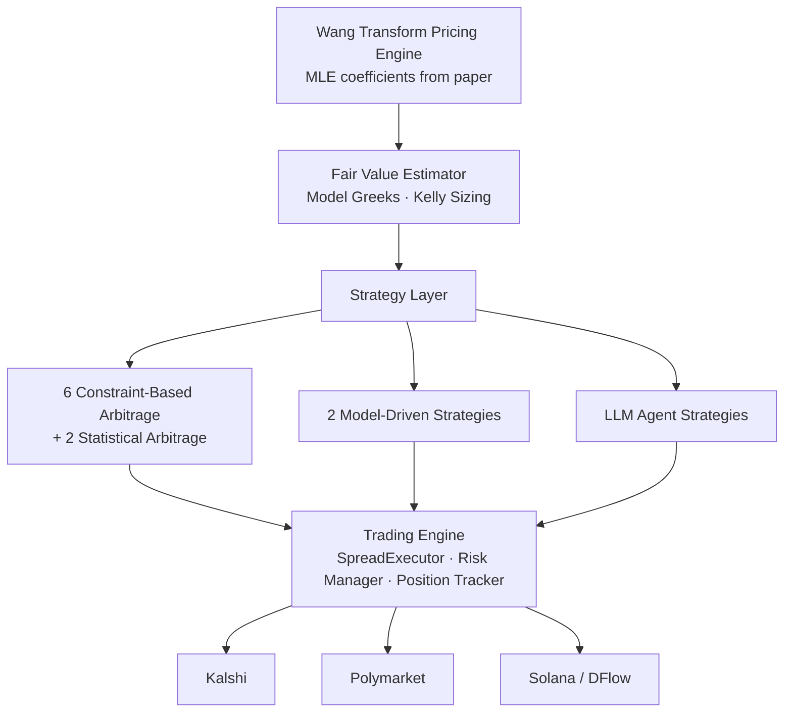

# Oracle3

**Autonomous prediction market trading agent across Kalshi, Polymarket, and Solana.**

[](https://github.com/YichengYang-Ethan/oracle3/actions)
[](https://github.com/YichengYang-Ethan/oracle3/actions)
[](https://github.com/YichengYang-Ethan/oracle3/actions)
[](https://codecov.io/gh/YichengYang-Ethan/oracle3)

[](LICENSE)
[](https://github.com/YichengYang-Ethan/oracle3/discussions)
[](https://github.com/YichengYang-Ethan/oracle3/commits/main)
[](https://yichengyang-ethan.github.io/oracle3/)
[](https://doi.org/10.5281/zenodo.20062548)

## Origin and attribution

Oracle3 began as `ulab-uiuc/oracle3`, developed by Yicheng Yang and Haofei Yu at U Lab (University of Illinois Urbana-Champaign) under the MIT License, and it bundles the [`coinjure`](https://github.com/ulab-uiuc/prediction-market-cli) package from the same lab. The strategy, pricing, risk, dashboard, and test layers in this repository were added on top of that base; see [NOTICE](NOTICE) for the retained license text.

## Why this exists

Prediction markets price binary contracts at systematically biased levels — a true 50/50 contract typically trades around **0.57** (favorite-longshot bias, $\hat{\lambda} \approx 0.183$). Most trading bots ignore this distortion entirely. Oracle3 operationalizes the Wang Transform (Wang 2000), calibrated in the author's working paper (Yang 2026) on **291,309 resolved contracts** across six venues, to detect and price the bias through arbitrage detection and Kelly-sized model trades.

> **Status:** paper-traded research engine, not a live-capital system. See [Status & Limitations](#status--limitations) before drawing performance conclusions.

This system deploys the exact $\lambda$ estimates and covariate model from [prediction-market-pricing](https://github.com/YichengYang-Ethan/prediction-market-pricing) (Yang, 2026) as its real-time pricing engine.

## How oracle3 differs from existing prediction-market tools

| | Oracle3 | polymarket-whales | prediction-market-maker | py-clob-client |
|---|---------|-------------------|-------------------------|----------------|
| Pricing model | Wang Transform (calibrated MLE) | None | Bid-ask MM | None |
| Rule-based strategies | 10 (6 constraint-arb · 2 stat-arb · 2 model-driven) | None | None | N/A |
| Multi-venue | Kalshi + Polymarket + Solana | Polymarket only | Polymarket only | Polymarket only |
| On-chain execution | Solana via DFlow + Jito | No | No | N/A (SDK) |
| Working paper | Yang (2026), SSRN | No | No | No |
| Tests | 633 | 0 | 0 | 50+ |
| License | Apache 2.0 | MIT | MIT | MIT |

## Architecture


```mermaid
graph TD
    A[Wang Transform Pricing Engine<br/>MLE coefficients from paper] --> B[Fair Value Estimator<br/>Model Greeks · Kelly Sizing]
    B --> C[Strategy Layer]
    C --> D[6 Constraint-Based Arbitrage<br/>+ 2 Statistical Arbitrage]
    C --> E[2 Model-Driven Strategies]
    C --> F[LLM Agent Strategies]
    D --> G[Trading Engine<br/>SpreadExecutor · Risk Manager · Position Tracker]
    E --> G
    F --> G
    G --> H[Kalshi]
    G --> I[Polymarket]
    G --> J[Solana / DFlow]
```

## Strategies

**Constraint-based arbitrage** — each exploits a violated probability axiom:

| Strategy | Invariant |
|----------|-----------|
| Cross-Market | Same event, same price across exchanges |
| Exclusivity | $P(A) + P(B) \leq 1$ for mutually exclusive events |
| Implication | $P(A) \leq P(B)$ when A implies B |
| Conditional | $P(A \mid B) \in [L, U]$ within derived bounds |
| Event Sum | $\sum P(\text{outcome}_i) = 1$ within an event |
| Structural | $P(A) = \beta \cdot P(B) + \alpha$ from calibrated model |

**Statistical arbitrage**: cointegration spread (self-calibrating z-score), lead-lag (cross-correlation).

**Model-driven**: fair value divergence (Wang-model edge), premium decay (rides predictable premium lifecycle).

## Pricing Engine

Deploys the Wang Transform from Yang (2026), calibrated on 291,309 contracts across 6 platforms:

$$p^{\text{mkt}} = \Phi\bigl(\Phi^{-1}(p^*) + \lambda\bigr), \quad \hat{\lambda} = 0.183 \; (p < 10^{-15})$$

- **Hierarchical model**: $\lambda_i = 0.259 - 0.072 \ln(1+V) + 0.143 \ln(1+D) - 0.477 |p-0.5|$
- **Model Greeks**: $\partial p / \partial \lambda$, Kelly fraction, edge decay rate
- **Online calibrator**: hybrid batch MLE + streaming EWMA with category shrinkage
- **Correlation-aware risk**: EWMA correlation matrix, effective exposure limits

> Yang, Y. (2026). *Pricing Prediction Markets: Risk Premiums, Incomplete Markets, and a Decomposition Framework.* Working Paper, UIUC. [[Replication package]](https://github.com/YichengYang-Ethan/prediction-market-pricing)

## Quick Start

```bash
git clone https://github.com/YichengYang-Ethan/oracle3.git && cd oracle3
poetry install

oracle3 market list --exchange polymarket --limit 10
oracle3 dashboard --exchange solana --initial-capital 10000
```

See [docs](https://yichengyang-ethan.github.io/oracle3/) for full CLI reference.

## Key Technical Choices

- **Event-driven async engine** with snapshot persistence and Unix socket control (pause/resume/killswitch)
- **SpreadExecutor** — multi-leg execution component with automatic LIFO unwind on partial fills to prevent naked legs (unit-tested; being wired into the multi-leg strategies)
- **Dual-layer risk**: local position/drawdown/exposure limits + Solana `simulateTransaction` pre-flight
- **On-chain audit trail** via Solana Memo program; Jito bundle submission (best-effort MEV protection, with public-RPC fallback)
- **633 tests**, ruff, mypy, codespell CI on every push

## Status & Limitations

Oracle3 is a **paper-traded research engine**, not a live-capital system. Being explicit about what is and is not demonstrated:

**Verified**
- The pricing engine deploys the exact MLE coefficients from the companion working paper (Yang 2026), verified digit-for-digit against the [replication package](https://github.com/YichengYang-Ethan/prediction-market-pricing): correct Wang-Transform inverse direction, analytic-gradient MLE with clustered standard errors, 633 tests.

**Not yet demonstrated**
- **Paper-traded only — no live track record.** Performance figures are deliberately not published: the flagship fair-value strategy is being wired end-to-end (see roadmap), and the committed replay episodes are short smoke tests, not statistically powered backtests.
- **Fees close most taker arbitrage.** Prediction-market taker fees (Kalshi ≈ `0.07·p·(1−p)` per contract) exceed the 1–3¢ edges the constraint-arbitrage strategies target. Net-of-fee edge survives mainly on the zero-fee Polymarket surface and in model-driven trades held to resolution. A fee-frontier analysis quantifies exactly where edge does and does not survive (in progress).
- **Experimental modules.** `oracle3/experimental/` (flash-loan arbitrage) and the multi-agent pipeline are prototype skeletons — clearly labeled and excluded from the trading path.

**Roadmap to live**
1. Close the pricing loop (resolution-fed calibrator, fee-aware net edge) so the fair-value strategy trades end-to-end.
2. Fee-adjusted, walk-forward backtest on the 291,309-contract resolved panel with clustered bootstrap confidence intervals.
3. Pre-registered forward paper-trading track record with timestamped daily snapshots.

**Research program:** oracle3 is the production artifact of a research line — [SSRN working paper](https://papers.ssrn.com/sol3/papers.cfm?abstract_id=6468338) → this real-time engine → a planned companion paper on recalibration and incentive effects in prediction markets.

## Star History

[](https://star-history.com/#YichengYang-Ethan/oracle3&Date)

## Contributors

[](https://github.com/YichengYang-Ethan/oracle3/graphs/contributors)

If oracle3 helps your research or trading, please ⭐ star the repo — it helps others find it.

## License

Apache 2.0 — see [LICENSE](LICENSE) for details.

*This software is for research and educational purposes. Trading involves financial risk.*
