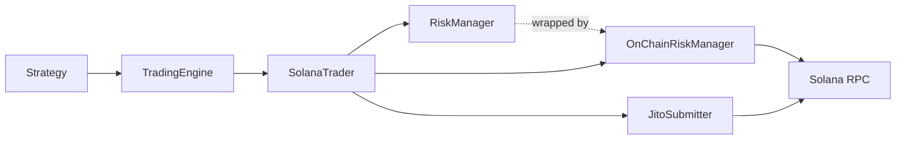

# Solana Pre-flight Risk and Submission

## Overview

Oracle3 applies two risk layers before recording a live Solana trade. The local layer evaluates portfolio limits before a transaction is requested, while the on-chain layer simulates the signed transaction with Solana JSON-RPC immediately before submission. The simulation verifies whether the transaction would execute without a runtime error; it does not replace the local position, exposure, drawdown, or loss controls.

## Component diagram



`TradingEngine` provides the event loop and binds the strategy to the trader. When the strategy places an order, `SolanaTrader` coordinates both risk layers: it calls `RiskManager.check_trade()` before requesting a transaction, then calls `OnChainRiskManager.simulate_transaction()` after signing it and before either Jito or standard RPC submission.

## Local risk checks

`OnChainRiskManager` wraps `StandardRiskManager` and delegates its first decision to `StandardRiskManager.check_trade()` (`oracle3/risk/onchain_risk_manager.py:86`). The local checks run in sequence and reject the trade as soon as one fails:

| Guard | Behavior | Source |
| --- | --- | --- |
| Maximum single trade | Rejects when `quantity * price` exceeds `max_single_trade_size`. | `oracle3/risk/risk_manager.py:89` |
| Position limit | Rejects a buy that would exceed `max_position_size` for the ticker; sells reduce the position and pass this guard. | `oracle3/risk/risk_manager.py:94` |
| Total exposure | Excludes cash from current exposure and rejects a buy that would exceed `max_total_exposure`. | `oracle3/risk/risk_manager.py:115` |
| Drawdown | Tracks peak portfolio value and rejects when current drawdown reaches the configured maximum. | `oracle3/risk/risk_manager.py:134` |
| Daily loss | When configured, rejects after portfolio loss exceeds `daily_loss_limit`. | `oracle3/risk/risk_manager.py:156` |
| Open positions | Rejects a new buy when `max_positions` is reached, while allowing sells and additions to existing positions. | `oracle3/risk/risk_manager.py:169` |

`SolanaTrader.place_order()` also performs order-shape, short-selling, and available-cash checks before the risk manager is called (`oracle3/trader/solana_trader.py:343`).

## On-chain pre-flight

After the DFlow Trade API returns a serialized transaction, `SolanaTrader` deserializes and signs it. If its risk manager is an `OnChainRiskManager`, the trader sends the signed bytes to `simulate_transaction()` before submission (`oracle3/trader/solana_trader.py:171`).

The method base64-encodes the signed transaction and sends this JSON-RPC request (`oracle3/risk/onchain_risk_manager.py:110`):

```json
{
  "jsonrpc": "2.0",
  "id": 1,
  "method": "simulateTransaction",
  "params": [
    "<base64 signed transaction>",
    {
      "encoding": "base64",
      "commitment": "confirmed",
      "replaceRecentBlockhash": true
    }
  ]
}
```

Oracle3 reads `result.value.err` and `result.value.logs` from the response. A non-null `err` rejects the transaction and prevents submission. A null `err` permits submission, and the log count is written only at debug level. The current implementation does not independently enforce compute-unit limits, inspect account writes, or calculate slippage from the simulation response; those concerns must be handled by transaction construction, local risk rules, or upstream APIs.

## MEV protection

When Jito support is enabled, `SolanaTrader` passes the validated signed transaction to `JitoSubmitter.submit_with_jito()` (`oracle3/trader/jito_submitter.py:70`). The submitter creates a two-transaction bundle containing the trade and a SOL tip, then sends it to the Jito Block Engine. If Jito rejects the bundle or the request fails, the submitter falls back to Solana `sendTransaction` with RPC pre-flight enabled (`skipPreflight: false`) (`oracle3/trader/jito_submitter.py:200`).

After either Jito or standard RPC returns a signature, `SolanaTrader` polls `getSignatureStatuses` until the transaction is confirmed, finalized, failed, or times out (`oracle3/trader/solana_trader.py:211`). Positions are updated only after confirmation succeeds.

## Failure modes

| Failure | Current behavior |
| --- | --- |
| Simulation RPC timeout, transport error, or malformed response | `simulate_transaction()` catches the exception and fails open, allowing submission to continue. The later submission and confirmation steps can still reject the trade. |
| `BlockhashNotFound` or another simulation error | The error appears in `result.value.err`, so simulation returns `False` and `SolanaTrader` blocks submission. `replaceRecentBlockhash: true` reduces stale-blockhash failures during simulation but does not guarantee later inclusion. |
| Simulation succeeds but submission RPC rejects | Standard submission raises an error; Jito submission falls back to standard RPC. The order returns an unknown failure and no position is recorded. |
| Submission returns a signature but execution fails | `getSignatureStatuses` reports a non-null `err`; confirmation returns `False` and no position is recorded. |
| Confirmation does not arrive within 30 seconds | Confirmation returns `False`; the order is treated as failed even though final network outcome may require separate reconciliation. |
