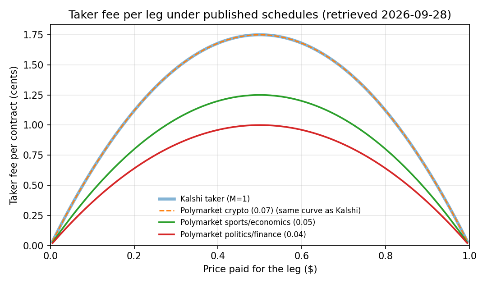

# Do prediction-market arbitrage edges survive fees?

*Oracle3 research note. Fee schedules retrieved 2026-09-28. Reproduce every number with `python scripts/fee_frontier.py`.*

Related contracts are tied together by probability. If A implies B, P(A) cannot exceed P(B); if an event has n exclusive outcomes, their probabilities sum to one. When quoted prices break one of these bounds, a basket of contracts that pays a known amount in every state can be bought for less than that amount. The question is how large the gap has to be before the basket is worth buying, once every leg pays the venue's fee.

This note answers that from the published fee schedules alone. It uses no market data, so it says nothing about how often such gaps appear. It says how large they must be.

## The fee on one leg

Both venues charge taker fees proportional to p(1 − p), where p is the price paid for the contract:

| Venue | Taker fee | Maker fee | Source |
|---|---|---|---|
| Kalshi | round_up(0.07 · M · C · P · (1 − P)) | round_up(0.0175 · M · C · P · (1 − P)), only on series with maker fees | Kalshi Fee Schedule, "Last updated and effective: July 7, 2026" |
| Polymarket | C · rate · p · (1 − p), with a per-market rate | none; makers are never charged | docs.polymarket.com, "Trading fees" |

On Kalshi, M is the series multiplier. It is 1 for most series and 0 for a few fee-free ones; the API reports it as `fee_multiplier`. Polymarket documents default rates of 0.07 for crypto, 0.05 for sports, economics, culture and weather, 0.04 for finance, politics, mentions and tech, and 0 for geopolitics. Each market reports its own rate in the Gamma API's `feeSchedule`. Among the 100 highest-volume active markets on 2026-09-28, the rates were 0.05 (41 markets), 0.04 (14), 0.07 (13), 0.03 (12) and 0 (7), and 13 markets had fees disabled.



The fee peaks at a price of 0.50, where a Kalshi taker leg costs 1.75¢ per contract, and falls to zero at the extremes. A Kalshi taker leg and a Polymarket crypto leg cost the same.

## Two-leg baskets

An implication, exclusivity, complement or cross-venue basket has two legs. The break-even violation per contract is the sum of the two legs' fees:

| Leg 1 | Leg 2 | both legs at 0.1 | both legs at 0.3 | both legs at 0.5 |
|---|---|---:|---:|---:|
| Kalshi taker (M=1) | Kalshi taker (M=1) | 1.26¢ | 2.94¢ | 3.50¢ |
| Kalshi taker (M=1) | Polymarket politics/finance (0.04) | 0.99¢ | 2.31¢ | 2.75¢ |
| Kalshi taker (M=1) | Polymarket sports/economics (0.05) | 1.08¢ | 2.52¢ | 3.00¢ |
| Polymarket politics/finance (0.04) | Polymarket politics/finance (0.04) | 0.72¢ | 1.68¢ | 2.00¢ |
| Polymarket crypto (0.07) | Polymarket crypto (0.07) | 1.26¢ | 2.94¢ | 3.50¢ |
| Polymarket geopolitics (0) | Polymarket geopolitics (0) | 0.00¢ | 0.00¢ | 0.00¢ |

A one-cent mispricing between two mid-priced contracts is not tradable with taker orders on either venue. At mid prices the violation has to exceed 2 to 3.5 cents per contract before any edge is left.

## Buying every outcome of an event

For an event with n exclusive outcomes priced p_1, …, p_n that sum to about one, buying every outcome costs a total fee per contract of

    k · Σ p_i (1 − p_i) = k · (1 − Σ p_i²)

where k is the taker coefficient. With equal prices this is k · (1 − 1/n), which grows with the number of outcomes:

| Outcomes (equal prices) | Kalshi taker (M=1) | Polymarket politics/finance (0.04) | Polymarket sports/economics (0.05) |
|---:|---:|---:|---:|
| 2 | 3.50¢ | 2.00¢ | 2.50¢ |
| 3 | 4.67¢ | 2.67¢ | 3.33¢ |
| 5 | 5.60¢ | 3.20¢ | 4.00¢ |
| 10 | 6.30¢ | 3.60¢ | 4.50¢ |
| 20 | 6.65¢ | 3.80¢ | 4.75¢ |

Many-outcome events are where the sum of quoted prices most often drifts away from one, and they are also where the fee hurdle is highest. On Kalshi it approaches 7 cents.

## Rounding on small orders

Kalshi's schedule rounds each fee up so that fee plus position cost lands on a centicent ($0.0001). Its illustrative table rounds to the cent. The difference only matters for small orders:

| Contracts at $0.50 | Centicent rounding | Cent rounding (schedule table) |
|---:|---:|---:|
| 1 | $0.0175 | $0.02 |
| 2 | $0.0350 | $0.04 |
| 5 | $0.0875 | $0.09 |
| 10 | $0.1750 | $0.18 |
| 100 | $1.7500 | $1.75 |

`oracle3.fees` uses centicent rounding by default and `increment=CENT` reproduces the table.

## Where edge can still exist

- **Fee-free markets.** Polymarket markets with a zero rate and Kalshi series with M = 0.
- **Maker legs.** Polymarket makers pay nothing, and most Kalshi series charge no maker fee. A resting order may never fill, though, and a basket with one filled leg and one resting leg is a directional position until the second leg fills.
- **Legs at extreme prices.** The fee falls toward zero as a leg's price approaches 0 or 1.
- **Size.** Fees scale linearly with size, so size does not change the break-even violation. Depth does: the displayed size at the best price limits how much of a violation can be captured.

## What this note does not show

It does not measure how often violations above these thresholds occur, how long they last, or how deep the book is when they do. It assumes every leg fills at the quoted price and that the relation between the contracts is specified correctly, including their resolution rules. Settlement differences between venues can turn an apparent same-event arbitrage into two different bets.

## Checking a live pair

The MCP server applies these schedules to live quotes. For two markets you believe describe the same event:

```text
check_constraint_live(relation="same_event",
                      markets=[{"venue": "kalshi", "market_id": "<ticker>"},
                               {"venue": "polymarket", "market_id": "<gamma id>"}])
```

The result reports the cheapest basket, its gross edge, the fee on each leg under that market's own schedule, and the edge left after fees.
